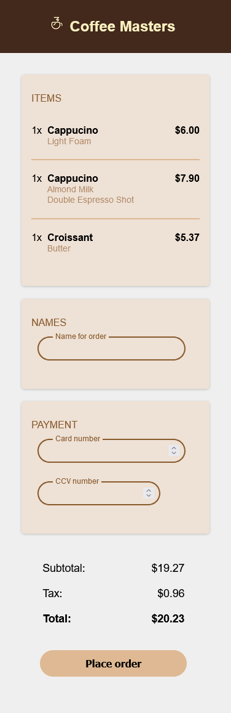
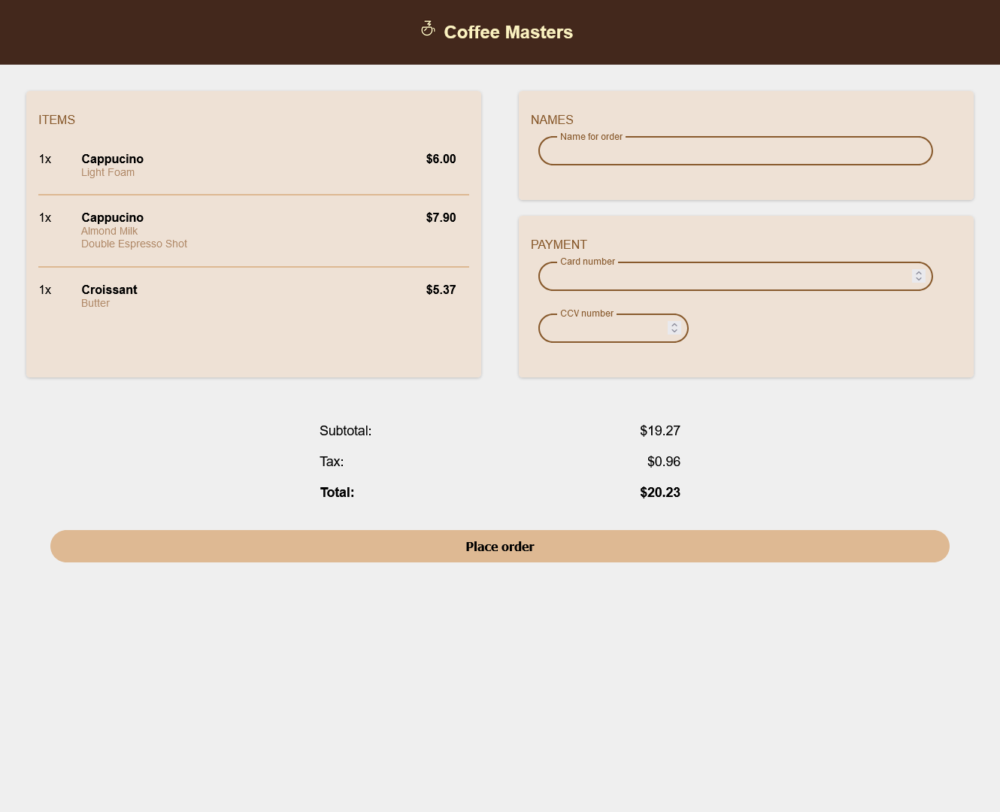

# Coffeemasters Checkout page

This is my solution for the Coffee Masters HTML project from [Frontendmasters](https://frontendmasters.com/courses/web-development-v3/)

## Table of contents

- [Overview](#overview)
  - [Screenshot](#screenshot)
  - [Built with](#built-with)
- [Author](#author)

## Overview

### Screenshot

### Built with

- Semantic HTML5 markup
- CSS custom properties
- Flexbox

## Author

- Twitter - [@actual_susu](https://www.twitter.com/actual_susu)